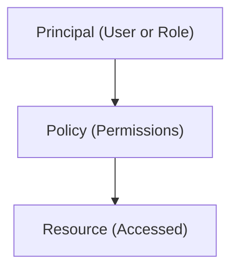

# Overview of Access within Identity and Access Management (IAM)

## IAM Access Control Diagram

In Identity and Access Management (IAM), access control ensures that the right individuals and services have appropriate permissions to interact with resources. Here’s a short summary of the core components of access within IAM:

## Key Components of IAM Access Control

1. **Principals**: Entities (users, groups, or services) that can request access to resources. Each principal is assigned an identity within the system.

2. **Policies**: Policies define what actions principals are allowed (or denied) to perform on specific resources. There are generally two types of policies:
   - **Identity-based policies**: Attached to a user, group, or role, specifying what that identity can do.
   - **Resource-based policies**: Attached directly to a resource, controlling who has access and what actions are allowed.

3. **Permissions**: Permissions specify which actions a principal can perform on a resource. Permissions are enforced by policies.

4. **Roles**: Roles are sets of permissions that can be assigned to users, groups, or services, allowing access to perform specific tasks without granting all permissions.

5. **Access Control Lists (ACLs)**: Additional controls, typically used in data storage or file systems, to control permissions at a more granular level.
